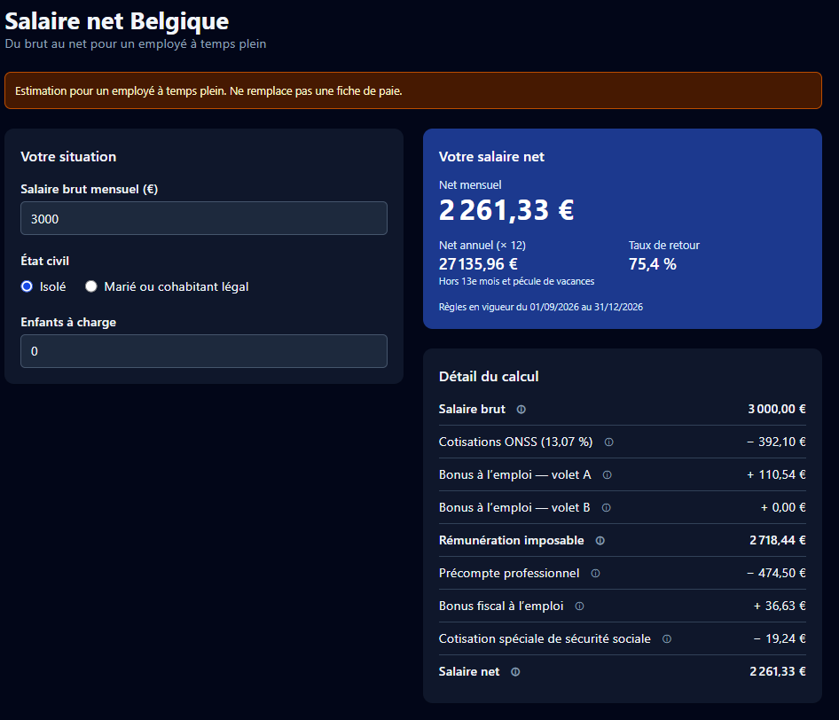

# Salaire net Belgique

Calculateur de salaire mensuel pour un employé à temps plein en Belgique, dans les deux sens : du brut au net, ou du net souhaité au brut nécessaire. Exact au centime selon les règles officielles en vigueur du 1er juillet au 31 décembre 2026.

Chaque ligne du détail (ONSS, bonus à l'emploi, précompte professionnel, bonus fiscal, cotisation spéciale) cite sa source officielle. Les avantages extralégaux exonérés — titres-repas, indemnité de télétravail, écochèques — s'ajoutent au calcul pour donner le net réellement versé sur le compte. L'avantage de toute nature d'une voiture de société se saisit tel qu'il figure sur la fiche de paie, ou se calcule depuis la voiture.



## Démarrer

```powershell
npm install
npm run dev
```

## Scripts

| Commande | Rôle |
|---|---|
| `npm run dev` | serveur de développement |
| `npm test` | tous les tests (Vitest) |
| `npm run typecheck` | vérification TypeScript |
| `npm run lint` | oxlint |
| `npm run build` | build de production dans `dist/` |
| `python tools/reference/reference.py` | régénère les 74 cas de référence et les 8 cas voiture |
| `npm run verifier:recul` | mesure le recul maximal du net sur toutes les situations, tous les bruts au centime et trois niveaux d'avantage de toute nature (0, 300 et 1 000 €/mois) ; à relancer après tout changement de paramètres |

## Comment l'exactitude est vérifiée

- Le moteur (`src/engine/`) calcule en centimes entiers, avec les arrondis imposés par les textes.
- `tools/reference/reference.py` recalcule 74 situations directement depuis les textes officiels, sans réutiliser le code TypeScript. Le moteur doit reproduire chaque valeur intermédiaire au centime.
- Un cas n'est marqué `verifie: true` qu'après comparaison avec une source externe. `src/engine/__tests__/fichesReelles.json` contient deux fiches de paie réelles de 2025 (anonymisées : uniquement des montants), confrontées ligne par ligne au calcul du moteur : ONSS, bonus à l'emploi, rémunération imposable, base du précompte, bonus fiscaux, cotisation spéciale et part personnelle des chèques-repas.
- Avantage de toute nature (voiture de société) : saisi tel qu'il figure sur la fiche, ou calculé depuis la voiture selon l'art. 36 § 2 CIR 92 — valeur catalogue × coefficient d'âge × 6/7 × pourcentage CO₂ (5,5 % aux émissions de référence, ± 0,1 % par gramme, entre 4 % et 18 %, 4 % pour l'électrique), avec un minimum annuel. Le mois de la première immatriculation compte comme le premier mois. L'ATN entre dans la base du précompte mais ne se retire pas du net : le brut ne le contenait pas. La contribution personnelle réduit l'ATN imposable et se retire du net versé. `tools/reference/reference.py` recalcule les cas voiture indépendamment du moteur. Le montant mensuel vaut l'annuel divisé par 12, avec le coefficient d'âge du mois. Les tranches d'âge commençant le 1er du mois de la première immatriculation, un mois n'est jamais partagé entre deux coefficients : le prorata calendaire des exemples de la FAQ désigne le même coefficient que nous pour un mois donné, et ne s'en écarte qu'en annuel, sur la seule année civile qui franchit une frontière (moins d'un euro). Douze mensualités ne redonnent donc pas exactement l'annuel : l'écart est celui de l'arrondi.
- Résultat de cette vérification : les cotisations ONSS, les deux volets du bonus à l'emploi, la rémunération imposable, la base du précompte, les bonus fiscaux, la cotisation spéciale et la part personnelle des chèques-repas correspondent au centime. **Le précompte professionnel, lui, ne correspond pas** : la formule-clé officielle 2025 (SPF Finances, ESS-SR/2024-0015) donne 17,85 €/mois de plus que les deux fiches. L'écart est constant sur les deux mois, il n'est expliqué par aucune règle du document officiel, et il est figé par un test dédié qui échouera le jour où on l'expliquera. Piste principale : le secrétariat social applique peut-être les barèmes mensuels officiels plutôt que la formule-clé.
- Net → brut : `calculerBrut` renvoie le plus petit brut dont le net atteint la cible. Le net ne monte pas toujours avec le brut (arrondis, marche de la cotisation spéciale). La recherche redescend donc jusqu'à ce que le net passe sous « cible − 10 € ». C'est exact tant que le net ne recule jamais de plus de 10 €. `npm run verifier:recul` le mesure sur toutes les situations, tous les bruts au centime et trois niveaux d'avantage de toute nature, et un test échoue si la mesure manque ou dépasse la marge. Au-delà de 1 000 €/mois, la dernière mesure disponible reste celle de la V2.3 : ponctuelle jusqu'à 10 000 €/mois d'avantage, elle donnait 5,15 € sans déplacer le pire point.
- Avantages extralégaux : titres-repas, indemnité de télétravail et écochèques sont exonérés d'ONSS et d'impôt tant que les plafonds ONSS sont respectés. Le calcul ne fait que des multiplications entières, ne touche pas au salaire, et signale par une alerte tout dépassement de plafond, sans modéliser le basculement en salaire.

## Sources

- SPF Finances, formule-clé du précompte professionnel 2026 (ESS-SR/2025-0928)
- ONSS, instructions administratives 2026/3 : bonus à l'emploi, cotisation spéciale de sécurité sociale
- ONSS, instructions administratives : titres-repas, frais propres à l'employeur (indemnité de bureau), éco-chèques
- ONSS, instructions administratives 2025/3 (bonus à l'emploi) et SPF Finances, formule-clé 2025 : période de référence des fiches de paie vérifiées
- Art. 36 § 2 CIR 92 (avantage de toute nature des voitures de société), arrêtés royaux fixant les émissions de CO₂ de référence 2025 et 2026, et SPF Finances, FAQ voitures de société 2026 (minimum annuel : 1 690 € pour les revenus 2026, 1 650 € pour 2025)

## Limites de la V1

Employé à temps plein uniquement ; le calcul net → brut couvre les mêmes situations que le brut → net. Pas d'ouvriers, de temps partiel, de 13e mois ni de pécule de vacances. Voiture de société : ni la règle des « fausses hybrides », ni les voitures sans donnée CO₂, ni la cotisation CO₂ patronale. Les avantages extralégaux couverts sont supposés conformes à leurs conditions d'exonération (convention collective, télétravail structurel). Le nombre de titres-repas est saisi librement : les fiches réelles montrent que les employeurs ne suivent pas tous la règle « un titre par jour presté ». Estimation qui ne remplace pas une fiche de paie. Détails dans `docs/superpowers/specs/`.
